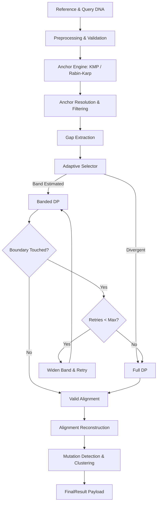

# AlignX

**Adaptive Anchor-Guided DNA Sequence Alignment**

AlignX is a modular DNA sequence alignment framework that bridges the gap between fast heuristic approximations and strict mathematical guarantees. By decomposing sequences using exact matching anchors and adaptively sizing dynamic programming (DP) bounds for the remaining gaps, AlignX significantly accelerates alignment on high-homology sequences without sacrificing the mathematical optimality guaranteed by classical Needleman-Wunsch.

## Problem Statement
Traditional sequence alignment algorithms like Full Dynamic Programming (DP) guarantee exact optimal alignments but scale quadratically in time and memory $O(N \cdot M)$. For long, highly similar DNA sequences, this evaluates millions of fundamentally unreachable cells.

## Architecture


## Key Capabilities
- **Anchor Engine**: Discover linear exact matches via Knuth-Morris-Pratt (KMP) or Rabin-Karp and resolve overlapping constraints monotonically.
- **Adaptive Banding**: Scale DP diagonal bands dynamically based on local gap insertion/deletion length disparity.
- **Boundary-Aware Retries**: If the traceback path approaches the computed band edges, the gap is automatically widened and re-run.
- **Full DP Fallback**: If the band safety is violated repeatedly, the gap degrades safely to exact Full DP.
- **Streamlit Research Dashboard**: A visual interface to inspect anchors, gaps, structural variant mutations, and algorithmic selector traces.

## Technology Stack
- **Language**: Python 3.11+
- **Testing**: `pytest`
- **UI/Visualization**: `streamlit`, `pandas`, `matplotlib`

## Installation
Ensure you have Python 3.11 or later installed.
```bash
git clone https://github.com/Aryasurya12/AlignX.git
cd AlignX
python -m pip install -e ".[dev]"
```

## Running the Application
Launch the Streamlit research dashboard to run deterministic sequences, visualize tracebacks, and explore decision metrics.
```bash
streamlit run streamlit_app.py
```

## Testing & Benchmarking
Run the full regression test suite (128 passing tests):
```bash
PYTHONPATH="src" pytest
```

Execute the Phase 7 benchmark pipeline (generates deterministic CSV scalability tests):
```bash
PYTHONPATH="src" python -m experiments.run_phase7 --smoke
PYTHONPATH="src" python -m experiments.run_phase7 --scale
```

## Performance Results and Limitations
For sequence lengths up to 10,000 bp with high homology (e.g., identical matches or sparse mutations), AlignX demonstrates measured CPU speedups of **100x to 500x** over native Python $O(N \cdot M)$ Full DP baseline execution. This speedup relies heavily on completely bypassing DP cell evaluation within long exact anchors.

**Limitations:**
- **Quadratic Fallback**: In completely divergent sequences lacking exact anchors, AlignX safely falls back to standard $O(N \cdot M)$ complexity.
- **Memory Footprint**: Absolute peak application RSS memory has not been explicitly measured; resource usage is theoretically bounded via DP dimensions.
- **String Slicing**: Python string slicing poses a constant-factor bottleneck on high-frequency, extremely short microscopic gaps.
- **Synthetic Scope**: Validation relies heavily on synthetic datasets to exercise edge cases safely.

## Documentation
- [Phase 8 Research Paper](paper/alignx_research_paper.md)
- [Final Project Report](docs/final_project_report.md)
- [Reproducibility Guide](docs/reproducibility.md)
- [Evidence & Claim Audit](docs/performance_claim_audit.md)
- [Phase 9 Final Release Report](docs/phase9_final_release_report.md)

## Current Status
**Phase 9 Complete.**
The project includes a full synthetic test suite, benchmark generator, and academic release documentation.

## License
*Pending project decision.*
